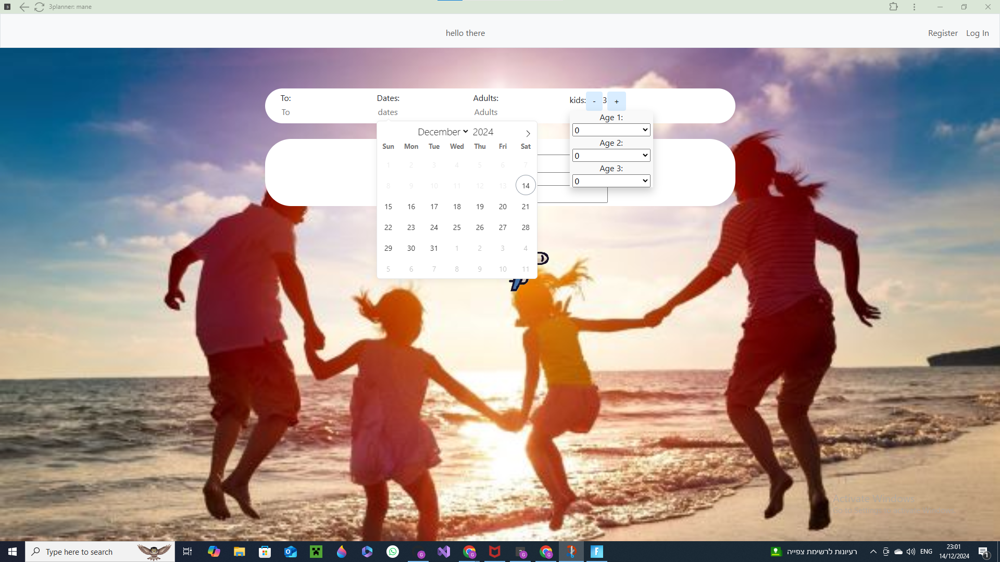
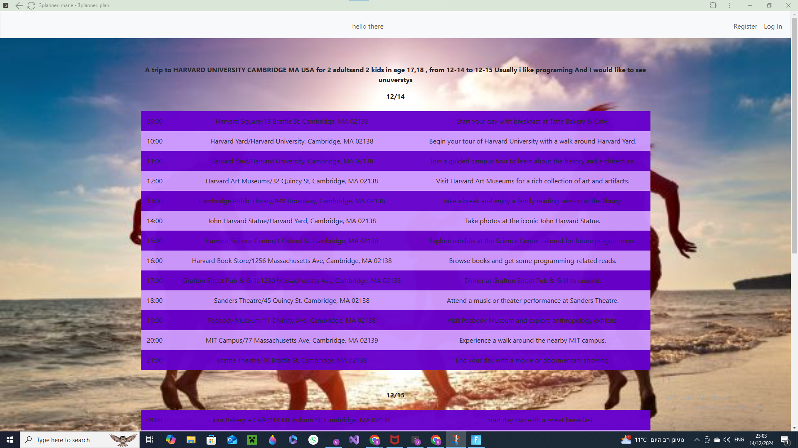
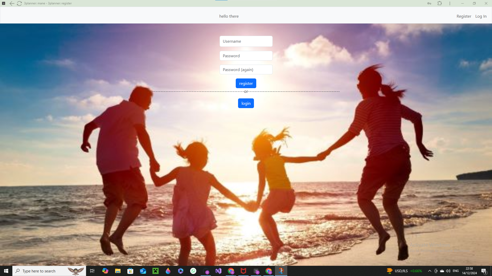
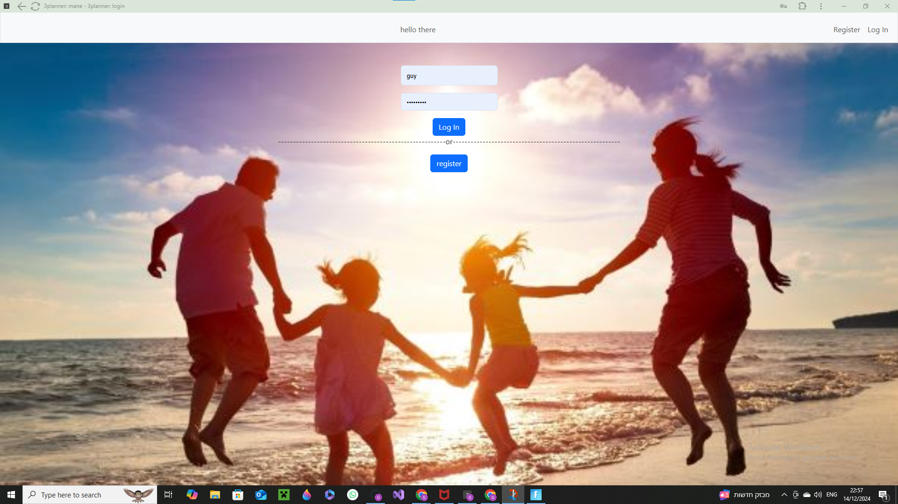

# 3Planner - README


## The video -
Video Demo:  [Video](https://youtu.be/aymzr5HGcFw)
## Who am I
Hi, I'm Guy Halevy (AKA guy_89 in EDX or guy-halevy in GitHub) I'm 15 years old (but I started the course when I was 14), in the 10th grade, from israel

After taking this course learned that I LOVE coding, and I decided to take Cyber as a major in my school. I just started the first year, but it looks much simpler than this course.

**Sorry in advance - I am dyslexic and dysgraphic, so please excuse my typos**

## The project - trip planner (or 3planner) website
I created a website that helps people to plan their trips.

The user inserts the trip details like destination, dates, number of adults, number of kids and their ages, the user’s hobbies, and the locations that the user wants to visit on this trip.

Then the program takes all those inputs and creates a prompt to the AI engine (ChatGPT), which returns a complete plan for the trip.

Once the user gets the planned trip, the user can customize the trip by telling the AI engine (ChatGPT) about locations that the user likes or dislikes, or locations that the user wants to add more or less time to in this location.

The user can customize the trip until it becomes perfect to the user’s preferences.

Those trips are saved into a database and the user (assuming logged-in) can visit all the trips and keep modifying it anytime.


## A personal story why I wanted to do it
I love planning my family vacations but it always takes a lot of time.

I use ChatGPT, but it never gets to a perfect plan, and I always have to add more manual work.

So… I thought to myself that I should make a program that plans the vacation for me.

## The program

### Prerequisite
Verify that the ChatGPT API in installed on the system
you my need to run dis
```Bash
pip install openai
```

Set the OPENAI_API_KEY environment variable


### Technologies
I used the following technologies:

- HTML

- CSS

- Javascript

- Flask / Jinja

- Python

- ChatGPT API

- Google maps API

- SQLite database

### Screen - index.html


This is the home screen for the user where the user can instruct the AI engine to create a trip plan.

The user provides the data of the trip:
- Destination
- Dates
- Number of adults
- Number of kids and their ages
- The activities that the user enjoy doing
- Locations or activities that the user would like to do during this trip

For the location, there is an API with google maps to auto-complete it (see more details below)
For the dates, the flatpickr utility is used to allow the user to select the required dates.

Once the user inserts all those inputs, the user click the airplane icon to have the AI engine start working on planning this trip.

If the user is logged in, and this user has already some planed trip in the database, the user will see those trips, and can select any of them to see the plan and to customize it.

### Screen - Loading.html


As it takes time for the AI engine to process the data, the user sees a spinning airplane icon.

### Screen - Plan.html


- The user sees the trip plan in a table with one hour break down.
- The plan is displayed in a table that includes:
- Time - when to do this activity
- Location - where to go
- Description - what to do there

If the user is not logged in, the user can log in and save the trip plan.

If the user is logged in, the user can customize the trip by telling the AI engine to:
- Spend more time to this activity/location
- Spend less time in this activity/location
- Pass and don't do this activity/location at all
- Like this activity/location which hints the AI engine to have more similar activities

### Screen - Register.html


The user can register to the web-site and unlock the ability to customize and save the trip plan.

The user sets his Username and Password (twice in order to verify) and hit the “Register” button.

The program adds the username and the hash of the password into the users table in the database.

### Screen - Login.html


If the user already registered to the web site, the user can login and see the planned trips and customize the trips.

The user sets his Username and Password and hit the “Log In” button.

The program verifies that the user and the password are aligned with the info written to the users table in the database.

### Screen - Apology.html


If there is a problem with the web site, the user sees a nice apology screen.

### Layout.html


This is the layout of all the HTML pages.
It includes a nice background picture and the upper navber.

The navbar includes:
- A greeting to the user
- An option to return the home page from any other page
- An option to logout

### script.js
A java script file that includes all the java-script scripts of the project
The 3 main functions are
- Set input on the kids
	- Sets the number of kids
	- Sets the kids ages - sets the ages of each kid.
- Trip location - using auto complete to help the user with finding the right place like Country, state, region or city. Power by google-maps API
- Sets the trip dates - using a nice display to show the calendar and allow the user to select the trip dates

### styles.css
This is the CSS file, it includes all the design concepts. Like Tables, Input-fields, Nav-bars, etc…

### App.py
A Python code that includes many of the functions/logic :
- Function register - handles new user registration process
- Function login - handles the login process of an existing user
- Function logout - handles the logout process of a user
- Function index - communicates with the AI engine (ChatGPT) and parsing the data it sends to or gets from ChatGPT
- Function save - allow an anonymous user to save the trip by logging-in or registering to the site
- Function costomise - sends the customized request back to the AI engine
- Function login_register - switch the UI from login to register and from register to login
- Function lode - creates a nice icon on the screen while the porgram interacts with Chat-GPT in the background


### Chat GPT integration
The AI engine of the program is actually ChatGPT with integration over API.

The AI engine is used to take the user’s input and generate a full trip plan for this location.

#### The program uses the following prompts
##### For the initial creation of the trip-plan:
	write in English ,plan a trip with a 60 minutes breakdown, to {to}, for {Adults} adults and for {children_amount} kids in age {kids} , from {dates} . Usually i like {like}. And I would like to see {Places}.The output must include 4 columns - (1) date, (2) time, (3) location and (4) description , and only those columns. The output should be in a CSV format, but instead of coma use '|P|' as the values separator, and also add '|R|' at the end of each line, and dont add 'enter' or '\n' at the end of the lines, and dont add headers at the first line. The date format should be (month/day) and location should include (name/address) - in this order and nothing else. dont do greeting . Give me a full answer for all days and every hour from 9:00 till 22:00 PM, dont stop at the middle of my trip. And dont worry about checking-in or checking-out from the hotel or going to or from the airport - I have full days there  from 9:00 AM till 22:00 PM.

Where:
- {to} is the trip destination
- {Adulats} is the number of adults in this trip
- {children_amount} is the amount of children
- {kids} is the ages of the kids
- {dates} is the dates of the trip

##### For customizing an existing plan:
	({csv_s}) . This is the trip that you created for me in a csv format. Its good , but please halp me to customize it by doing those changes - {costomise}. Make it in the same format: write in English ,plan a trip with a 60 minutes breakdown .The output must include 4 columes - (1) date, (2) time, (3) location and (4) description , and only those columns. The output should be in a CSV format, but instead of coma use '|P|' as the values separator, and also add '|R|' at the end of each line, and dont add 'enter' or '\n' at the end of the lines, and dont add headers at the first line. The date format should be (month/day) and location should include (name/address) - in this order and nothing else. dont do greeting . Give me a full answer for all days and every hour from 9:00 till 22:00 PM, dont stop at the middle of my trip. And dont worry about checking-in or checking-out from the hotel or going to or from the airport - I have full days there  from 9:00 AM till 22:00 PM.

Where:
- {csv_s} - includes the existing plan
- {costomise} - includes the customization requests

Those prompts were modified over time, and I found those wordings to provide the best results.

#### API for ChatGPT-4o
```python
client.chat.completions.create(messages=[{"role": "user","content": text}],model="gpt-4o",)
```
You can find more details about the API on this link - [GPT API reference](https://platform.openai.com/docs/api-reference/introduction)

### Google maps API
In order to auto-complete the names of all the world's countries/regions/cities/etc… the program uses Google maps API.

While the google maps API is very rich with many details, the program needs to get only the countries, regions or cities. Getting so many details would overwhelm the user, so the program minimizes the Google maps output only to the required details.

You can find more details about the API on this link - [Google maps API reference](https://developers.google.com/maps/documentation/javascript/examples/places-autocomplete)


### The DataBase
The program stores all the data in database.db file.

There are 2 main tables and another table per each trip-plan.
The tables are:
- Users - includes the following columns
	- id - the user id
	- username - the user username
	- hash -the user hash password
	- Cantrise - includes the following columns
	- id - the user id of the won who on the trip
- cantrise - what country we are planning to visit
	- tabs - how many days
	- visbol_prompt - the description of the trip
- A table per each planned-trip - Those tables contain the trip plan with all the details
The name format is - {user_id}id{trip_destination}. The table includes the following columns
	- id - the primary key
	- date - the dates of the trip
	- time - the time, one hour break down
	- location - the location for the given time
	- description - description with recommendations what they user should do in this location


## Next version
On the next version I plan to:
- Allow the user to save several trip-plans to the same destination
- Allow the user to modify the password
- Allow the user to book a flight, hotel and/or restaurants directly from the program
- Add to the description a link to google-maps

